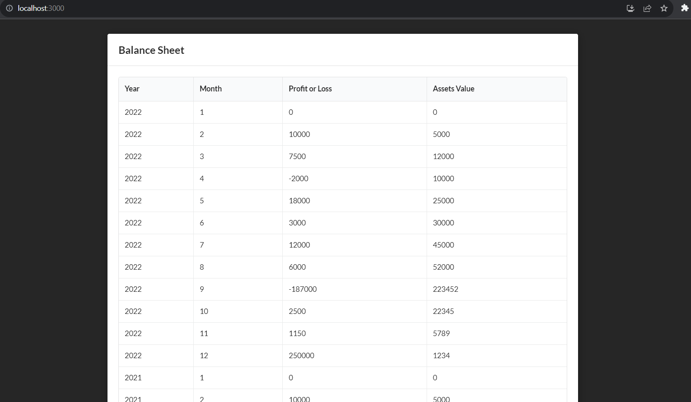

# business-loan-application

## Quick Start

To get started with this project, follow these simple steps:

1. Navigate to the root directory of the project.

2. ```cd backend && npm i && cd ..
   cd frontend-loan-app && npm i && cd ..
   cd accounting-software && npm i && cd ..
   cd decision-engine && npm i && cd ..
   ```

3. Run the following command to launch the application using Docker Compose:

   ```bash
   docker-compose up
   ```

## Now, your application is up and running!

## About

This project is composed of multiple services, all of which are containerized using Docker:

- Frontend: ReactJS (port 3000)
- Backend: NodeJS (port 3001)
- Accounting Software (port 3002)
- Decision Engine (port 3003)

### Styling

For styling and creating a visually appealing and responsive frontend, we use the Semantic UI React library.

### Screenshots




